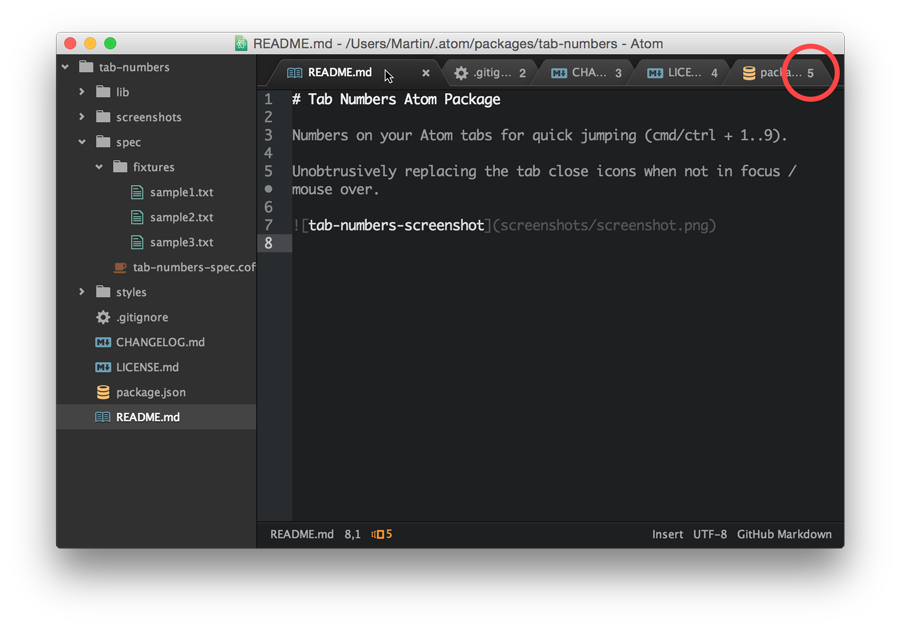

# Tab Numbers Atom Package

Numbers on your Atom tabs for quick jumping (cmd/ctrl + 1..9).

Unobtrusively replacing the tab close icons when not in focus / mouse over.

Also adds a total tabs count to the status bar, which can be disabled via config.

> Contributions, bug reports and feature requests are very welcome.

> &nbsp; &nbsp; _- Martin_
